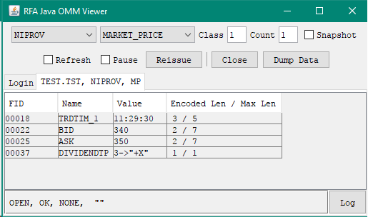
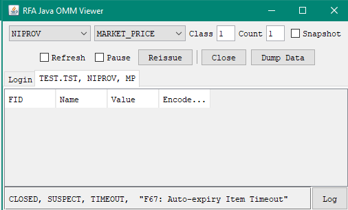

# Creating Auto Expiring Records on TREP #
## How to create records that auto delete after a configured time ##

**Knowledge Prerequisite** – Must have an understanding of a Reuters streaming API such as
EMA, RFA and be familiar with consuming OMM Market Price data (see end of article for links to relevant tutorials).

There maybe a scenario where you want to create records on TREP for other users within your organisation to consume for a limited time only or maintain a cache of a limited size. For example: 

- The content is only valid for a limited period of time, after which you do not wish anyone to consume the record
- You wish to keep a rolling history of events for a given period e.g. past 24hrs or past 7 days
- Only keep a configured number of records in the cache and drop the oldest when item count is exceeded
 
With each of the above it would be nice if you could just focus on the creation of the records and not have to worry about keeping track of and then deleting the expired or superfluous records.

The ADH component of TREP offers the facility to Auto expire records from its user populated cache after a given period of time or when a maximum cache size is exceed. So, for example you could specify that a record is dropped 24hrs after it was created or updated OR drop the oldest record when the cache size exceeds a configured number. 

There are some provisos / limitations to this facility

- The user has to populate the cache using either Post messages or using an Non-Interactive Provider application
- All items / records cached under a given service name are configured using the same expiry criteria - you cannot specify varying expiry criteria for subsets of items
- As the parameters are on a per service basis, you can create multiple services - each with its own expiry criteria    

Therefore, if the data is being generated by end-users then you would typically use the Post mechanism - where users can Post records into the cache from their desktop application. For server based data creation, you would typically use a Non-Interactive provider application which publishes the records to the Cache.

### Technical Prerequisites ###
In order to use the above feature, you will of course need a TREP installation and the ability to amend / update the TREP configuration. If you are unsure please speak first to your Market Data team to ensure this is possible.
 
Assuming you are in a position to amend the TREP configuration, the first step will be to define the cache as a Non Interactive Provider (NIP) service/source on the TREP system. Your Market Data team may well be familiar with the steps required - otherwise you can refer to the guide we have published on our Developer Portal:

[TREP Configuration for NI Providers](https://developers.thomsonreuters.com/elektron/elektron-sdk-java/learning?content=11680&type=learning_material_item)

You will need to decide on a name for this new service e.g. I am going to use **_NIPROV_** for the purpose of this article. Your Market Data team may be able to advise on a suitable name - based on any internal policy. 

Once the steps from the above guide have been applied and you have confirmed the new NIP service is available, please check the following parameters are set as follows in the TREP config file.

\*NIPROV\*cacheLocation : ssl  
\*NIPROV\*cacheType : sourceDriven  
\*adh\*cacheServiceList : NIPROV  

Obviously you will need to replace NIPROV with your own chosen service name.

You can then proceed to add the Auto expiry related configuration parameters as follows:

- \*adh\*servicename\*autoExpiryItemBaseline: {creation, update} : Time from which an item's age is calculated for auto expiry. It could be configured to be item creation time, or the time of its most recent update. Default value is update
- \*adh\*servicename\*autoExpiryItemTimeUnits: { seconds, minutes, hours, days } : Units in which Auto Expiry timeout is measured. Default value is days.
- \*adh\*servicename\*autoExpiryItemTimeout: { 0 - N } : Age at which the item is closed by auto expiry. When set to 0, autoExpiry based on item age is disabled. The timeoutinterval is measured in units specified in 'autoExpiryItemTimeUnits'.
- \*adh\*servicename\*autoExpiryMaxListSize: { 0 - N } : The ADH can automatically close the oldest items when the number of cached items exceeds the limit specified in autoExpiryMaxListSize. The default is zero, meaning auto expiry for the oldest cached item(s) is not enforced.

So, for example if I wanted my service to expire items 60 minutes after creation I would use:  
\*adh\*NIPROV\*autoExpiryItemBaseline: creation  
\*adh\*NIPROV\*autoExpiryItemTimeUnits: minutes  
\*adh\*NIPROV\*autoExpiryItemTimeout: 60

Or, if I wanted to expire an item 24hrs after it was last updated I would use:  
\*adh\*NIPROV\*autoExpiryItemBaseline: update  
\*adh\*NIPROV\*autoExpiryItemTimeUnits: hours  
\*adh\*NIPROV\*autoExpiryItemTimeout: 24
 
Alternatively, if I wanted to expire the oldest item once the cache size reached 10,000 items I would use:  
\*adh\*NIPROV\*autoExpiryItemTimeout: 0  
\*adh\*NIPROV\*autoExpiryMaxListSize: 10000

Finally, if I wanted to expire my items 7 days after creation but also limit the cache size to 10,000 I would use:  
\*adh\*NIPROV\*autoExpiryItemBaseline: creation  
\*adh\*NIPROV\*autoExpiryItemTimeUnits: days  
\*adh\*NIPROV\*autoExpiryItemTimeout: 7  
\*adh\*NIPROV\*autoExpiryMaxListSize: 10000

It is possible to persist the cache items to storage during ADH shutdown (or on demand) if you need to - but this will increase the ADH shutdown and restart times, especially if the cache contains a large number of items. You should discuss this with your Market Data team - details on how to configure cache persistence can be found in the ADH Install guide.

Note that if cache persistence is enabled, the time of loading the item from cache will be considered the baseline creation time. For expiry from last update, the expiry timer only starts after the first update comes in (after reloading) - since the update time is not persisted to storage.

So, once the above configuration has been implemented and the ADH is restarted, you can then proceed with the creation and the updating of items in the cache.


### Creating and Updating Cache Items ###
As mentioned earlier the cache can be populated using a Non-Interactive Provider application and/or Post Messages.   
For a server application based scenario the Non-Interactive Provider application would typically be the most appropriate choice. For end user / desktop applications, the PostMsg functionality should be used.
Although the techniques / functionality below can be implemented using Reuters Foundation API(RFA), Elektron Transport API(ETA) and Elektron Message API, I will focus on EMA - as this will allow me to keep the code snippets and hence the article to an easily readable length. The types of tutorials / examples I refer to below also exist for RFA and ETA - either on the Tutorial pages for the API on this website OR included with the respective API packages.

#### Non-Interactive Provider ####
With regards Non-Interactive Provider application functionality, we have NIP application tutorials for both EMA Java and C++ on our Developer Portal which you can refer to:   

[EMA C++ NI Provider Tutorial](https://developers.thomsonreuters.com/elektron/elektron-sdk-cc/learning?content=11257&type=learning_material_item)   
[EMA Java NI Provider Tutorial](https://developers.thomsonreuters.com/elektron/elektron-sdk-java/learning?content=12016&type=learning_material_item)

I recommend you work through the appropriate tutorial, create and or update some records. Simultaneously run a consumer to consume the items you have created have - to ensure they exist and then wait for the expiry criteria to kick in - as per your auto expiry configuration parameters.

I would recommend enabling the EMA's XML Trace file facility for the Consumer to help verify the records are expiring as per the configuration. This will allow you to leave the consumer running unattended for a while and then examine the timestamps in the XML Trace file after the consumer is terminated.  

For EMA C++ the XMLTrace File related config parameters ```XmlTraceToFile``` and ```XmlTraceFileName``` can be used to control the trace output to a file.         

For EMA Java you can use the ```XmlTraceToStdout``` parameter with standard Java functionality to redirect StdOut to a file.

Please refer to the EMA Config Guide for further details on the above parameters.

#### Using PostMsg to Create and Update records ####

Posting allows Consumer / desktop applications to push content into the ADH Cache. The application needs to firstly Login to the server as per normal and then use that session to Push the content to the server. There are two types of Posting mechanism that can be used - Off-Stream and On-Stream:    
- **Off-Stream Posting** An application can send a post without first having to subscribe to that item - by using the existing Login handle to Post the data  
- **On-Stream Posting** The application has to first request the item and then use the item handle to Post the data

So, for example if  you have a desktop application where the user views existing items and then wants to update them, you would use On-Stream Posting. If, however, the user just wishes to create new items or update existing items (e.g. based on data from another source), you could use Off-Stream Posting.   

The EMA Java and EMA C++ dev kits include examples that demonstrate both techniques under the Series 300 folder i.e. example340 for On-Stream and example341 for Off-Stream.

For the purpose of this tutorial I will refer to the Java examples - the code for the C++ examples is very similar.

##### Off-Stream PostMsg to Create a New Record #####
Since I don't have any records in my ADH cache, I will use the Off-Stream technique to create some records and update them.

For this I will use the ***example341\__MarketPrice\__OffStreamPost*** from the EMA devkit as the starting point.    
The following explanation assumes you are familiar with using EMA to consume MarketPrice data as a minimum - as per the prerequisites (if not, I recommend you work through the relevant Tutorials linked at the end of the Article). 

Normally, EMA performs the the Login request and processes the response (behind the scenes) on behalf of the developer. However, to perform an Off-Stream post the application needs to get hold of the handle for the Login stream so it can be used to submit the PostMsg.
So, the applications registers a client to for the MMT_LOGIN domain.

```java

{
	AppClient appClient = new AppClient();
	consumer = EmaFactory.createOmmConsumer(EmaFactory.createOmmConsumerConfig().host("10.11.234.56:14002").username("umer.nalla"));
		
	ReqMsg reqMsg = EmaFactory.createReqMsg();
	consumer.registerClient(reqMsg.domainType( EmaRdm.MMT_LOGIN ), appClient, consumer);

	Thread.sleep(60000);			// API calls onRefreshMsg(), onUpdateMsg() and onStatusMsg()
} 
```

Here, the code declares the callback client, creates the OmmConsumer instance and provides the connectivity parameters + username. It then creates the ReqMsg and registers the callback client to receive the Login related events and messages. It also passes in the reference to the OmmConsumer instance using the Closure parameter.   
As you may know, whatever you pass in the Closure parameter is made available to the callback client's methods. 
Passing in a reference  to the OmmConsumer will allow the callback methods to use the OmmConsumer to submit a PostMsg.
So, let's go ahead and examine the onRefreshMsg callback method.   
   
```java
   
public void onRefreshMsg(RefreshMsg refreshMsg, OmmConsumerEvent event)   
{
...
	if ( refreshMsg.domainType() == EmaRdm.MMT_LOGIN && 
		refreshMsg.state().streamState() == OmmState.StreamState.OPEN &&
		refreshMsg.state().dataState() == OmmState.DataState.OK )
	{
		PostMsg postMsg = EmaFactory.createPostMsg();
		RefreshMsg nestedRefreshMsg = EmaFactory.createRefreshMsg();
		FieldList nestedFieldList = EmaFactory.createFieldList();
				
		//FieldList is a collection in java
		nestedFieldList.add(EmaFactory.createFieldEntry().real(22, 34, OmmReal.MagnitudeType.EXPONENT_POS_1));
		nestedFieldList.add(EmaFactory.createFieldEntry().real(25, 35, OmmReal.MagnitudeType.EXPONENT_POS_1));
		nestedFieldList.add(EmaFactory.createFieldEntry().time(18, 11, 29, 30));
		nestedFieldList.add(EmaFactory.createFieldEntry().enumValue(37, 3));
			
		nestedRefreshMsg.payload(nestedFieldList ).complete(true);
			
		((OmmConsumer)event.closure()).submit( postMsg.postId( 1 ).serviceId( 260 )
		  .name( "TEST.TST" ).solicitAck( true ).complete(true)    
		  .payload(nestedRefreshMsg), event.handle() );   
	}
	
	decode( refreshMsg );
	System.out.println();
}

```

This example has been coded so that it sends out a PostMsg once it receives the initial Login response. This is acheived as follows:      
- the method first verifies that it has received a Login Refresh and all is OK
- next it creates a PostMsg that it will use to perform the Post   
- it then creates a RefreshMsg to contain the Initial image i.e. full list of fields that represent the new item  
- a FieldList is created and populated with 4 fields; Bid, Ask, Trade Time and Dividend Type
- the FieldList is then loaded into the RefreshMsg
- Finally the PostMsg is submitted as follows:  
  *Specify a PostID of 1 - this will be returned as the Ack ID in the Ack Msg  
  *Set the serviceID for ADH Cache service to Post the item to (you can get this value from the TREP config file mentioned at the start of this article)  
  *Provide the RIC name for the new item   
  *Request an Ack (acknowledgement) message back from the server   
  *Load the above RefreshMsg into the PostMsg  
  *Specify the handle from this event as the one submit the Post with. As this event was for the Login RefreshMsg, the handle will be the Login stream handle - therefore an Off-Stream Post   
  *Finally the Login RefreshMsg is decoded and dumped out to the console     

**NOTE**: It should have been possible to call _serviceName("NIPROV")_ rather than _serviceId("260")_ - but this is a current shortcoming with EMA Java and should be fixed in a future release 

As this is just an example application, there are a few things to be aware of:
* The example is using a RefreshMsg - for the payload of the PostMsg - as it wants to send a full Refresh specifying all the fields the Records will contain. 
* If, however the record already exists and only a subset of the fields need to be updated, then an UpdateMsg payload should be used instead.   
* It is possible to send a RefreshMsg even if the item already exists, however, to minimise network bandwidth it is good practice to use an UpdateMsg containing only the fields that have changed.
* In this example the PostMsg is sent from the onRefreshMsg handler. In fact you can send a PostMsg at any point after you have connected to the server and performed a sucessful Login.
* As mentioned previously, you do need a handle to submit the PostMsg - so you either use the Loging handle for off-stream Posting or the item handle for On-Stream Posting
* To explore On-Stream Posting please take a look at ***example340\__MarketPrice\__OnStreamPost*** from the EMA devkit
  

Since the example sets the ```solicitAck(true)```, an ```onAckMsg()``` callback handler method has been implemented to handle the acknowledgement message:

```java
public void onAckMsg(AckMsg ackMsg, OmmConsumerEvent event)
{
	System.out.println("Received AckMsg. Item Handle: " +   
	    event.handle() + " Closure: " + event.closure());
	decode( ackMsg );
	System.out.println();
}
```  

Example output from onAckMsg() method:

```text
Received AckMsg. Item Handle: 1 Closure: com.thomsonreuters.ema.access.OmmConsumerImpl@668dc22c  
Item Name: TEST.TST  
Service Name: not set  
Ack Id: 1  
```
As you can see the Ack Id is returned as 1 - the same as the PostID we set in the PostMsg. This allows you to match an AckMsg to its correspnding PostMsg.

If for some reason the PostMsg fails (e.g. if the service you post to does NOT support Posting) then you would expect to receive a NACK response.  
For example I received the following when I tried to Post using an non-existant ServiceID
```text
Received AckMsg. Item Handle: 1 Closure: com.thomsonreuters.ema.access.OmmConsumerImpl@668dc22c  
Item Name: TEST2.TST
Service Name: not set
Ack Id: 1
Nack Code: DeniedBySource
Text: Unable to find service for post message.
```    
<br>
After running the example341 and sucessfully posting the TEST.TST record, I ran a test Consumer GUI application and captured the following:



As you can see the Bid, Ask, Trade Time and Dividend Type field have been populated as per the FieldList values specified in the onRefreshMsg() method earlier.   
The Stream State and Data State are reported as OPEN and OK- the StatusCode is NONE and the StatusText is empty.

I then left the test Consumer application running for just over 5 minutes (the value I had used for the autoExpiryTimeout in my NIPROV service configuration) and captured the the following:



When the TEST.TST record was deleted by the ADH, it sent out a Status Msg with the Stream State and Data State as CLOSED and SUSPECT respectively. The StatusCode was set to TIMEOUT and the StatusText reports 'F67: Auto-expiry Item Timeout'

Similarly, if you were to make a new request for the RIC after it had already expired, the Stream State and Data State would be reported as CLOSED and SUSPECT respectively. However, the StatusCode would be NONE and the StatusText would report 'F10: Not in Cache' - the same as requesting an item that had never existed in the ADH Cache.

#### Closing Summary ####
I hope the functionality and techniques covered above will allow you to simplify a particular implementation scenario that you encounter in your role as a developer.  
My personal use case was where I needed to keep a 7 day history of all the update events for a set of real time instruments on a particular feed, confirming time of receipt and a caching a few key values from each update.    
I developed my application to make streaming requests for those items and every time an update arrived, I used Posting to create a new record in the ADH cache with:   
-  the unique ID contained in that update as the item name (RIC) for the new record   
-  the time stamp of when my application received the update  
-  a copy of some key fields from that update.   

A consumer wishing to later query a particular update would subscribe to the item using the unique ID as the RIC.  

The key benefit to using the ADH Auto-Expiry functionality was I did not need to concern myself with writing the code to delete the history of events more than 7 days old - and I saved on the considerable testing that would have been required to ensure my code was deleting records in a timely and accurate manner. Obviously, you will still need to perform some testing to ensure the ADH AutoExpiry functionality is behaving as configured.

**Additional Resources**

If you have any further questions I recommend you post them on our Developer
Forum or contact our Data Helpdesk

>   [Developer
>   Forum](https://community.developers.thomsonreuters.com/index.html)

>   [Contact Data Helpdesk](http://my.thomsonreuters.com/ContactUsNew)

**Existing Tutorials mentioned above:**

>   [RFA C++
>   Tutorials](https://developers.thomsonreuters.com/thomson-reuters-enterprise-platform/robust-foundation-api-rfa/learning)

>   [RFA Java
>   Tutorials](https://developers.thomsonreuters.com/thomson-reuters-enterprise-platform/robust-foundation-api-rfa-0/learning)

>   [EMA C++
>   Tutorials](https://developers.thomsonreuters.com/elektron/elektron-sdk-cc/learning)

>   [EMA Java
>   Tutorial](https://developers.thomsonreuters.com/elektron/elektron-sdk-java/learning)

**Elektron API**

>   [Elektron SDK
>   C++ Download](https://developers.thomsonreuters.com/elektron/elektron-sdk-cc/downloads)

>   [Elektron SDK
>   Java Download](https://developers.thomsonreuters.com/elektron/elektron-sdk-java/downloads) 

      
