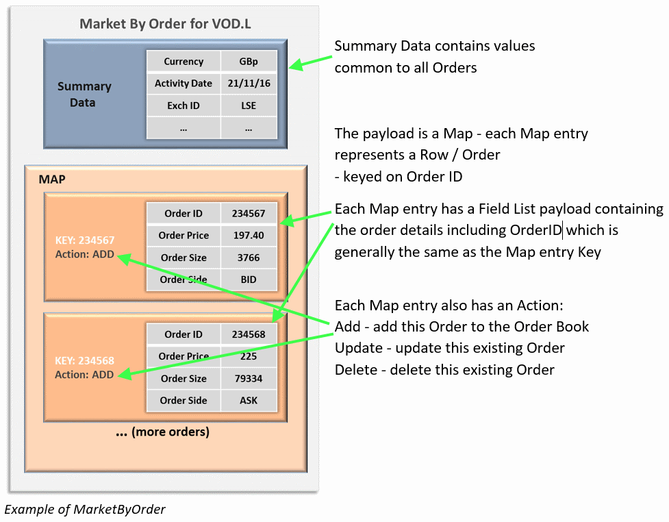
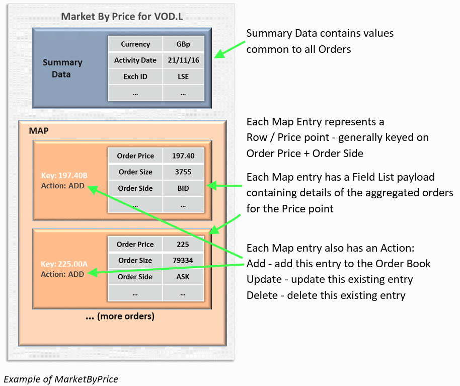

# L2-Test
Test Project for L2 Sorting code
## Sorting/Ranking Level2 Order Books for Display purposes
**Prerequisite** – Must have an understanding of a Reuters streaming API such as
EMA, RFA and familiarity with consuming OMM Market Price data.

This article provides a high level overview of Level 2 data and then explains how to sort the data. Firstly by covering the theory and then illustrating with some sample code

##### Part 1 : Overview of Level 2 data

-   Describe main features of Level 2 data

-   Explain MarketByPrice (MBP) and MarketByOrder (MBO) content

-   How to request MBP & MBO

-   How data is stored in MBP and MBO – i.e. Map with Field List & summary data

-   Multi-part RefreshMsg – Add, Update and Delete actions in RefreshMsg

-   UpdateMsg – *Add*, *Update* and *Delete* actions in Update

##### Part 2 : Sorting MarketByOrder and MarketByPrice

-   How to apply Order Ranking Rule and Price Ranking Rule

-   Explaination of different Enumeration values for OR\_RNK\_RUL field

-   Explaination of different Enumeration values for PR\_RNK\_RUL field

##### Part 3 : Sample code illustrating application of the above Rules

-   Order Ranking rules ‘PST’ (Price, Size, Time) & ‘PTS’ (Price, Time Size)

-   Price Ranking Rules NOR (Normal) and INV (Inverted)


### 1. Overview of Elektron Level 2 Data

Many of you use our streaming APIs to consume Market Price data i.e. Trade and
Quote prices - often referred to as Level 1 Data – from our Elektron feed. You
may be aware that it is also possible to consume Level 2 data from our Elektron
feed.

When we talk about Level 2 data, there are two categories of Level 2 data:
1. Legacy MarketFeed / MarketPrice Level 2 data - this is typically restricted to the top of the Order Book due to the flat structure which uses unique fields for each Orderbook entry e.g.
BEST_BID1, BEST_ASK1, BEST_BID2, BEST_ASK2, BEST_BID3, BEST_ASK3 and so on...
2. OMM Level 2 data - which allows full Order depth due to its use of hierarchical / nested data structures  

For example, making a MarketPrice request for VOD.LO will provide the legacy format record with only the top 10 orders for Vodafone from LSE. Making a MarketByPrice request (see later) for VOD.L will provide the full Order Book for Vodafone.

Because of the limited nature of the Legacy Level 2 data, it is possible to provide the data in sorted / ranked order.
However, since OMM Level 2 data provides fuller depth, it is not practical to transmit sorted / ranked data, especially given the potentially volatile nature of the data. 
Therefore, OMM Level 2 data is provided in unranked format and it is up to the developer to cache the data locally and sort the data as per their requirement. This article will illustrate how to achieve this.

**OMM Level 2 Data on Elektron**

OMM Level 2 data can provide a more comprehensive and deeper representation of the
current market activity. So, what Level 2 data is available from Elektron?

| Type            | Also known as                      | Description                                                                                          |
|-----------------|------------------------------------|------------------------------------------------------------------------------------------------------|
| Market-By-Price | Market Depth Aggregated Order Book | Collection of orders for an instrument grouped by Price point i.e. multiple orders per ‘row’ of data |
| Market-By-Order | Detailed Order Book                | Unique orders i.e. each ‘row’ represents a single order                                              |
| Market Maker    | Market Participants                | Market maker content where quotes from a single market maker reside within a single ‘row’            |

Each row contains the relevant data required to reflect the state of the market

| Type            | Main data items per row                                     |
|-----------------|-------------------------------------------------------------|
| Market-By-Price | Order Price, Side (Bid/Ask), Total Shares, Number of Orders |
| Market-By-Order | Order ID, Price, Side, Size                                 |
| Market Maker    | Participant ID, Bid, Ask, Bid Size, Ask Size                |

In addition to receiving the relevant collection of rows, each Level 2 response
from Elektron also contains Summary Data which relates to the whole collection.
This includes metadata such as order sorting/ranking rules, market information
such as the trading currency and state information such as Trading Status.

For the purpose of this article I will focus on the two more commonly used forms
of Level 2 data – Market-By-Price and Market-By-Order

**Requesting Level 2 data**

So, you should be familiar with requesting (Level 1) MarketPrice data. You need
to establish a connection to a Provider such as an ADS and Login successfully.
Once this is done, you then register interest in receiving realtime streaming
data by specifying the service name, instrument code and domain type of
MARKET\_PRICE.

To request Level 2 Data we need to change the domain to the relevant Reuters
Domain Model representing the type of Level 2 data you are interested i.e.
MARKET\_BY\_PRICE or MARKET\_BY\_ORDER

```c++
consumer.registerClient( ReqMsg()
      .domainType( MMT_MARKET_BY_PRICE )
      .serviceName( "ELEKTRON_DD" )
      .name( "VOD.L" ),
    client );
```

So, here we are requesting the MarketByPrice data for Vodafone from the
ELEKTRON\_DD service (using the Elektron Message API).

Assuming all is well, you should receive a RefreshMsg response which will be
passed to your callback handler in the client class specified in the above call.

**Parsing Level 2 data**

Before we can decode & parse the Level 2 data, we need to understand how the
data is encoded in the response payload.

As I mentioned earlier MarketByPrice and MarketByOrder data contains a
collection of data rows and a summary section too.





Note that I use the term ‘*generally*’ when referring to the Map entry KEY values.
This is because there are exceptions which need to be considered. These are
outside the scope of this article and can be explored further by contacting our
Data Helpdesk (see link at end of article).

**Summary Data**

The Summary Data contains non-order specific values like the Instrument name,
the currency that the instrument is quoted in, most recent activity time,
trading status, exchange ID and so on. You will receive Summary Data in the form
of a FieldList with a RefreshMsg. You may also receive Summary Data with an
UpdateMsg if appropriate.

**Map Entry Action**

So, what is the Action used for? Well, your application will typically maintain
a local representation of the complete Order Book and as the order book changes,
you don’t want to receive the complete order book each time.

Using the Action allows the bandwidth usage to be kept to a minimum, as the
Order Book changes, allowing individual Order Book entries to be added, amended
(updated) or deleted.

**Mandatory and Optional Fields**

Another key point to note is that the Field List payload has Mandatory and
optional fields. If one or more of the Mandatory field is missing from an entry
payload then it should be discarded.

For a MarketByOrder entry, both *Add* & *Update* type entries have the same
Mandatory fields:

| **FID Number** | **FID Acronym** | **Data Type** | **Description**                                                                              |
|----------------|-----------------|---------------|----------------------------------------------------------------------------------------------|
| 3426           | ORDER\_ID       | RMTES\_STRING | The order identifier of an order as represented on the native feed                           |
| 3427           | ORDER\_PRC      | REAL          | The Price of the order                                                                       |
| 3428           | ORDER\_SIDE     | ENUM          | Numerical value indicating the Side of the order                                             |
| 3429           | ORDER\_SIZE     | INT           | The Quantity of the order                                                                    |
| 6520           | PR\_TIM\_MS     | TIME          | The Priority Time Stamp, in GMT, of the order. Used to rank the order relative to its peers. |

For a MarketByPrice entry, the *Add* type entry has a fuller list of Mandatory
fields:

| **FID Number** | **FID Acronym** | **Data Type** | **Description**                                                    |
|----------------|-----------------|---------------|--------------------------------------------------------------------|
| 3427           | ORDER\_PRC      | REAL          | The Price of the order                                             |
| 3428           | ORDER\_SIDE     | ENUM          | Numerical value indicating the Side of the order                   |
| 4356           | ACC\_SIZE       | INT           | The total quantity of shares represented in an aggregated MBP row  |
| 3430           | NO\_ORD         | INT           | The number of orders in the aggregate MBP row                      |
| 6527           | LV\_TIM\_MS     | TIME          | The time, in GMT, an aggregated MBP row was most recently updated. |
| 6529           | LV\_DATE        | DATE          | The Date associated with the Level Priority Time Stamp.            |

The *Update* type entry of a MarketByPrice only has two Mandatory fields:

| **FID Number** | **FID Acronym** | **Data Type** | **Description**                                                    |
|----------------|-----------------|---------------|--------------------------------------------------------------------|
| 3427           | ORDER\_PRC      | REAL          | The Price of the order                                             |
| 6527           | LV\_TIM\_MS     | TIME          | The time, in GMT, an aggregated MBP row was most recently updated. |

Since MarketByPrice entries use the Price as part of the Key, an Entry type
action of *Update* will not actually be used to update the Price field – only
non-price fields (the Price is included for reference).

**RefreshMsg**

-   When you request an Order book, you will receive a RefreshMsg typically
    containing multiple Map Entries with (mostly) *Add* actions – each entry
    representing a Pending Order on the Market (MarketByOrder) or an aggregated
    Price point (MarketByPrice)

-   As an Order book can potentially contain a high number of rows, you will
    often receive multi-part RefreshMsgs, where each RefreshMsg contains a
    subset of the rows.

-   The final RefreshMsg will have the Complete flag set to true, indicating
    that all parts have been sent and the Order Book delivery is now complete.

>   It is always possible, for a large order book sent as multi-part
>   RefreshMsgs, that a row which was present in an earlier RefreshMsg was
>   deleted or amended before you received the Final RefreshMsg (complete order
>   book).

-   So, if for example, an Order was filled before you received the final
    Refresh, you will receive a Map Entry with an Action of *Delete* and the Key
    of the existing entry – allowing you to delete the corresponding row from
    your local Order book representation

-   Similarly if an existing Order was amended, then you will receive an Map
    entry with an Action of *Update*, the existing entry Key and a FieldList
    Payload containing the revised row details for the amended order

Once you have received a complete RefreshMsg with the full Order book, you can
then expect to receive UpdateMsgs whenever there is any Market activity which
affects the Order book

**UpdateMsg**

-   An UpdateMsg will contain a Map with one or more Map entries with Actions of
    *Add*, *Update* or *Delete* – where each entry includes the Map entry Key as
    well any other relevant content

-   If a new row is added to the book then you will receive a Map entry with
    Action of *Add*; the entry payload will be a FieldList containing the new
    row details

-   If an existing MarketByOrder entry changes, then you will receive a Map
    entry with action of *Update*, the Key of the existing entry to update and a
    FieldList containing the revised row details

-   Since the MarketByPrice Map entry Keys are based on the price, the behaviour
    is slightly different

    -   For a non-price change, you will receive a Map Entry with Action of
        *Update*, the existing Key and a FieldList containing the revised row
        details. As mentioned earlier, the FieldList will contain the existing
        price – however other fields such as Activity Time, Order size will
        reflect any changes to the row

    -   When the price of a MarketByPrice row changes, this affects the
        associated Map entry’s Key itself. Since there is no mechanism for
        updating a Map entry’s Key, the entry needs to be deleted and replaced
        with one with the new Key. Therefore, you will first receive a Map Entry
        with *Delete* action and Key of the entry to delete. This will be
        followed by another Map Entry with *Add* action for the new (revised)
        entry along with the new Key and corresponding FieldList.

-   When an row is removed from the Order book e.g. if a Pending Order was
    filled, you will receive a Map entry with an Action of *Delete* and the Map
    Entry Key of the entry to erase

That should cover the main relevant points you need to be aware of when dealing
with Order books.

Just to recap:

-   Order Books are implemented using the MarketByOrder and MarketByPrice
    Reuters domain Models.

-   The payload consists of Summary Data (which is non-order specific
    information) and a Map where each entry contains a FieldList representing an
    Order / Price point.

-   The Map entries include an Action which instructs whether to *Add* the entry
    as a new row in the Order book, to *Update* an existing row or *Delete* an
    existing row.

-   For *Add* or *Update* entries if any of the Mandatory fields are missing the
    entry should be ignored.

-   Since Order books can be quite large, they are usually delivered as
    multi-part Refresh messages and the final Refresh message is indicated by
    the Complete flag being set

I am not going to cover much of the code required to request and process an
Order book. This is because we already have Level 2 tutorials on our developer
portal for most of our TREP and ELEKTRON APIs (see links at the end of the
article). As the tutorials are basic console output applications, they don’t
tend to address the multi-part Refresh mechanism, so I will cover that as part
of the next section of this article.

The other aspect that the existing tutorials do not demonstrate, is how to
implement the above sorting / ranking mechanism for display purposes.

### 2. Sorting MarketByOrder and MarketByPrice

The important thing to be aware of, when you receive the Map with the Order book
rows entries, is that they are not sent in any explicitly ranked or sorted
order. However, Ranking rules are included in the Summary data to give the
consuming application a method by which to rank the order book when storing /
displaying the Order book at the application level.

There are two Ranking related fields in the Summary data section, to be used as
follows:

-   OR\_RNK\_RUL – indicates which fields should be used for ranking and
    displaying the orders in an Order book e.g. a value of ‘PTS – Price, Time,
    Size’ means the exchange has set the Order priority as Order Price, Order
    Priority Time and Order Size. In other words sort on Price first, and for
    any identical prices use the Priory Time field. Finally for any rows where
    the Price & Time values are equal, use the Size field.

-   PR\_RNK\_RUL – this indicates the Sort direction for the Order Price on the
    Bid and Ask sides of an Order book. For example, a value of ‘NOR’ – Normal
    would mean that we should sort Bid price from Highest to Lowest and Ask
    price from Lowest to Highest.

The current valid values for each of the above fields is as follows:

**OR\_RNK\_RUL**                                                                                     

| **Numeric**  | **Display** | **Ranking order fields**                                             |
|--------------|-------------|----------------------------------------------------------------------|
| 1            | PST         | Price, Size, Time                                                    |
| 2            | PTS         | Price, Time, Size                                                    |
| 3            | PRS         | Price, Rank, Size                                                    |
| 4            | OPTS        | Order Type, Price, Time, Size                                        |
| 5            | PN          | Price, Time Priority Sequence Number                                 |
| 6            | QMP         | Quote Type, Market Maker ID, Price, Quote Access Payment, Size, Time |
| 7            | PEN         | Price, Exchange Sequence Number                                      |

**PR\_RNK\_RUL**

| **Numeric**  | **Display** | **Meaning**                                                          | **Sort Order**           
|--------------|-------------|----------------------------------------------------------------------|-------------------------|
| 1            | NOR         | Normal Market                                                        | Bid – Highest to Lowest |                                                                                                                                                                             |              |             |                                                                      |                         | 
|              |             |                                                                      | Ask – Lowest to Highest |                                                                                                                                                                             |              |             |                                                                      |                         |
| 2            | INV         | Inverted Market                                                      | Bid – Lowest to Highest |                                                                                                                                                                             |              |             |                                                                      |                         |
|              |             |                                                                      | Ask – Highest to Lowest |                                                                                                                                                                             |              |             |                                                                      |                         |
| 3            | DCB         | Debit and Credit Book                                                | Ranked from lowest to highest values on both sides of the book. When the market is in Contango\*, Bid side shows Debit and Ask side shows Credit Transaction. The reverse is true when the instrument is in Backwardation\*. |

<sup>\*Contango & Backwardation markets – if you are not familiar with these terms I
recommend you speak to your analyst or search the web where you will find some detailed
definitions of these types of market</sup>

Note that both fields are Enumerated types, so the raw field value when
extracted from the Summary Data field will be the numeric one.

### 3. Sample code illustrating application of the above Rules

As I mentioned earlier, we already have some basic Level 2 Consumer Tutorials on
the Developer Portal – as well some examples included with our RFA and Elektron
APIs.

Most of the tutorials and examples are console based and simply decode and dump
the order books to the console in the arbitrary order the Map entries are
received by the application. However, for a realistic usage scenario it would
make more sense to sort the order book before displaying it.

Therefore, I will cover some sample code for sorting the order book.

**Storing the Order Book**

NOTE: I should point out that my example code below uses the C++ Elektron
Message API(see links at end of article) and is purely for illustrative purposes
only and should not be used as the basis for any production level application.

Before we can sort the Order Book, we need to cache it locally at the
application level – especially since any realistically sized Order Book will
most likely be delivered as Multi-Part RefreshMsgs, with each constituent part
arriving asynchronously.

As the Order Book entries / rows are delivered in a Map structure I am going to
use a std::map to store the unsorted rows as I receive them and to maintain the
rows as I receive updates to the order book.

I am using a template class of OrderBook to represent both MarketByPrice and
MarketByOrder data.
```c++
template <class T>
class OrderBook
{
public:
	typedef std::map<std::string, T > OrderBookEntries;
…
	std::string RicCode;		// Symbol for the OrderBook
	OBSummary summaryData;	// Summary Data for the OrderBook
	OrderBookEntries entries;	// Map of OrderBook Entries / rows
…
```

The OrderBook class contains a map to cache the OrderBook entries (rows) as well
as a class to represent the Summary Data.

The SummaryData as delivered with a MarketByPrice or MarketByOrder contains
multiple mandatory and optional fields – but for the purpose of this example I
am only going to store a few of the important fields.
```c++
class OBSummary
{
public:
…
        std::string displayName;	// Text name of instrument
	std::string timActMs;	// Last activity time to any order 
	std::string activDate;	// Date associated with above time
	UInt16 exchID; 	// Source Exchange for the Order Book 
	UInt16 currency;	// Currency in which the instrument is traded
	UInt16 prRnkRul;	// Numeric Value indicating how to display the Orders
	UInt16 orRnkRul;	// Numeric Value indicating how to rank/sort the Orders
…
```
SummaryData is delivered as a FieldList attached to the payload of the OrderBook
– decoding of which is covered by the existing tutorials.

To store the individual OrderBook entries I will use a base OBEntry struct for
the common field values and MBOEntry and MBPEntry structs for the MarketByOrder
and MarketByPrice specific field values.
```c++
struct OBEntry
{
public:
	double OrderPrc;	// Order Price
	UInt16 OrderSide;	// Order Side: 1=BID, 2=ASK
	char OrderSideChar;	// Char representation B / A
	UInt64 PrTimMs;	// Priority Time used for Ranking…
…
```
*Common Order Book Entry fields*

```c++
struct MBOEntry : public OBEntry
{
public:
	EmaString OrderID;	// Native feed Order ID
	double OrderSize;	// Quantity Of the Order
…
```
*MarketByOrder specific fields*

```c++
struct MBPEntry : public OBEntry
{
public:
	UInt64 NoOrd;		// Number of orders in MBP row
	double AccSize;	// Total shares represented in MBP row
	UInt64 LvTimMs;	// Time of most recent update for MBP Row
	UInt16 LvDay;		// Day associated with above time
	UInt16 LvMonth;	// Month associated with above time
	UInt16 LvYear;	// Year associated with above time
…
```
*MarketByPrice specific fields*

My example will request a MarketByPrice and a MarketByOrder instrument, so I am
going to declare two instances of the OrderBook in my Consumer Client class (the
callback handler)

```c++
// application defined client class for receiving and processing of item messages
class AppClient : public thomsonreuters::ema::access::OmmConsumerClient	
{

protected :
…
	OrderBook<MBOEntry> mboCache;	// Cache the MBO data
	OrderBook<MBPEntry> mbpCache;	// Cache the MBP data
…
```
*Cache for MBP and MBO instruments*

You should be familiar with requesting Level 2 data but just to recap, below is
my code to do this:

```c++
int main( int argc, char* argv[] )
{
  try { 
	AppClient client;
	OmmConsumer consumer( OmmConsumerConfig().host( "10.12.123.99:14002")
           	.username( "umer.nalla" ) );
	consumer.registerClient( ReqMsg().domainType( MMT_MARKET_BY_ORDER )
            	.serviceName( "ELEKTRON_DD" ).name( "SAGAG.L" ), client );
	consumer.registerClient(ReqMsg().domainType(MMT_MARKET_BY_PRICE)
        	.serviceName("ELEKTRON_DD").name("SAGAG.L"), client);
	for (UInt32 idx = 0; idx < 300; ++idx)
	{
		sleep(10000);
		client.dumpSorted();
	}
  } catch ( const OmmException& excp ) {
	cout << excp << endl;
  }
}
```
*Request a MBP and MBO instrument and register the AppClient class to handle the
response messages/data*

The code above will connect to and log in to a server and then request a MBP and
MBO for SAGA from LSE. It will then loop and dump the sorted Orderbooks every 10
seconds.

In the meantime, the AppClient will receive the initial Orderbook refresh and
update messages, process the payloads and update the corresponding cache
objects.

**Processing the RefreshMsg**

So, let us examine the RefreshMsg handler
```c++
void AppClient::onRefreshMsg(const RefreshMsg& refreshMsg,const OmmConsumerEvent& ) 
{
	if ( DataType::MapEnum == refreshMsg.getPayload().getDataType() )
decode( refreshMsg.getPayload().getMap() , refreshMsg.getDomainType());

	if (refreshMsg.getComplete())
	{
		if (refreshMsg.getDomainType() == MMT_MARKET_BY_ORDER)
		{
			std::vector<MBOEntry> mboVector;
			mboVector = mboCache.asVector();
			std::vector<MBOEntry>::iterator vit;
			cout << "MBO cache DUMP" << endl;
			for (vit = mboVector.begin(); vit < mboVector.end(); vit++)
				cout << vit->toString() << endl;
		}
		else if (refreshMsg.getDomainType() == MMT_MARKET_BY_PRICE)
		{
			std::vector<MBPEntry> mbpVector;
			mbpVector = mbpCache.asVector();
			std::vector<MBPEntry>::iterator vit;
			cout << "MBP cache DUMP" << endl;
			for (vit = mbpVector.begin(); vit < mbpVector.end(); vit++)
				cout << vit->toString() << endl;
		}
	}
}
```
When a RefreshMsg is received I check it has a Map payload before decoding it.

As I mentioned previously, Orderbooks are usually delivered as multi-part
RefreshMsgs, so when the final part of and Orderbook is received – indicated by
the Complete flag – I dump the Orderbook cache to the console (in its default
representation).

The decode method firstly stores the Summary Data (FieldList) in the
corresponding cache object

```c++
void AppClient::decode( const Map& map , UInt16 domainType)
{
	// Firstly let us extract any Summary Data present in the Map
	// A Map delivered in a RefreshMsg should always contains SummaryData 
	if ( map.getSummaryData().getDataType() == DataType::FieldListEnum )
	{
		if (domainType == MMT_MARKET_BY_ORDER)
                    decodeSummary(map.getSummaryData().getFieldList(), mboCache.summaryData);
		else if (domainType == MMT_MARKET_BY_PRICE)
                    decodeSummary(map.getSummaryData().getFieldList(), mbpCache.summaryData);
	}
…
```
*Extract and cache SummaryData*

Next, I iterate through the map and extract each entry and add to or update the
relevant cache object according to the domain model type and the entry’s Action
value
```c++
while ( map.forth() )
{
	const MapEntry& me = map.getEntry();
	DataType::DataTypeEnum dataType = map.getEntry().getLoadType();
	const EmaBuffer& keyBuff = map.getEntry().getKey().getBuffer();
	std::string key(keyBuff.c_buf(), keyBuff.length());
	MapEntry::MapAction entryAction = me.getAction();
	// Map entries with Add Action or Update action should have FieldList 		
        if ( (dataType == DataType::FieldListEnum) && (entryAction == MapEntry::AddEnum || entryAction == MapEntry::UpdateEnum))
	{
		if (domainType == MMT_MARKET_BY_ORDER)
		{	// If Key exists get entry - otherwise Add new entry
			MBOEntry & mbo = mboCache.entries[key];	
			// All mandatory fields must exist for Add
                        // otherwise delete newly Added entry
			if (!decodeMBOEntry(me.getFieldList(), mbo) && entryAction == MapEntry::AddEnum)
				mboCache.entries.erase(key);						
                }
		else if (domainType == MMT_MARKET_BY_PRICE)
		{	// If Key exists get entry - otherwise Add new entry
                    MBPEntry & mbp = mbpCache.entries[key];		
                    // Mandatory fields differ for Add / Update so pass Action	
                    if (!decodeMBPEntry(me.getFieldList(), mbp, me.getAction()) && entryAction == MapEntry::AddEnum)
			mbpCache.entries.erase(key); 	// Mandatory field(s) missing for Add, so delete entry				
                }
	}
	else
	{	// Map entries with Delete Action should have no data payload
		if ((dataType == DataType::NoDataEnum) &&  (me.getAction() == MapEntry::DeleteEnum))
		{	
			if (domainType == MMT_MARKET_BY_ORDER)
				mboCache.entries.erase(key);
			else if (domainType == MMT_MARKET_BY_PRICE)
				mbpCache.entries.erase(key);
…
```
As each entry is extracted from the map, I check that the payload is a FieldList
(which should always be the case). I also extract the Key for the entry so we
can use it as the key for our local cache std::map container entries.

I use the std::map operator[] to add a new entry to the corresponding cache or
access the existing entry - since the std::map is keyed on the Key we extracted
from the received MapEntry.

I know that if the Action for the entry is *Add* or *Update*, I need to decode
the entry payload in order to apply it to the appropriate std::map cache. The
decodeMBOEntry() and decodeMBPEntry() methods return false if the minimum
mandatory fields are not present in the FieldList payload . As mentioned
previously the mandatory fields for MBP depend on the Action type, so I pass
that in to the decodeMBPEntry() method. If any of the mandatory fields are
missing for an *Add* Action entry, I remove the newly added entry from the
cache.

If the Action for the entry is *Delete*, I remove the existing entry from my
local cache. Note that an entry with *Delete* Action should have an empty
payload.

I have not included the above decodeMBOEntry () and decodeMBPEntry() methods
here, as they are relatively long but straightforward – they extract each of the
mandatory fields, using a bitmask to ensure they are all present in the
FieldList payload. If any of the mandatory fields are missing, the values are
not applied to the cache entry.

So that covers the decoding of the initial Refresh image Orderbook entries into
my local cache – in their default representation.

**Processing the UpdateMsgs**

When an UpdateMsg is received containing any changes, I use the same decode
methods above to maintain my local cache.
```c++
void AppClient::onUpdateMsg( const UpdateMsg& updateMsg, const OmmConsumerEvent& ) 
{
	if ( DataType::MapEnum == updateMsg.getPayload().getDataType() )
		decode( updateMsg.getPayload().getMap() , updateMsg.getDomainType());
}
```
Once again I check the payload is of type Map before extracting the payload and
invoking the decode method with the payload and the domain type.

I do not dump the content of my cache on every UpdateMsg because that could
potentially overwhelm the console output on a volatile and/or large Orderbook.

So, at this point I should have a local cache of my MarketByPrice and
MarketByOrder instruments – being updated as and when there is any market
activity related to them – in their default unranked representation.

**Sorting the OrderBook**

In the first part of this article I covered the main fields and values that can
be used to sort the Orderbook.

For the purposes of this example I am going to focus on the most commonly used
Order Ranking and Price Ranking rules:

**OR\_RNK\_RUL**                                                

| **Numeric**  | **Display** | **Ranking order fields** |
|--------------|-------------|--------------------------|
| 1            | PST         | Price, Size, Time        |
| 2            | PTS         | Price, Time, Size        |

**PR\_RNK\_RUL**

| **Numeric**  | **Display** | **Meaning**              | **Sort Order**                                 |
|--------------|-------------|--------------------------|------------------------------------------------|
| 1            | NOR         | Normal Market            | Bid – Highest to Lowest                        |
|              |             |                          | Ask – Lowest to Highest                        |
| 2            | INV         | Inverted Market          | Bid – Lowest to Highest                        |
|              |             |                          | Ask – Highest to Lowest                        |

If you do find yourself consuming data that uses some of other ranking rules, it
should be relatively straightforward to apply the techniques described here –
with perhaps some input from our Data Helpdesk (contact details at the end) to
process and sort that data.

If you recall my main() method from earlier it calls the AppClient::dumpSorted()
every 10 seconds - so, let’s take a look at the code for that.

**Sorting our local caches**

I am using a std::map to store my local cache of the Orderbook – which as you
know is already sorted on the Order Key and therefore I transfer the content to
a std::vector in order to apply the Ranking rules.
```c++
void asBidAskVectors(std::vector<T> & bidVectors, std::vector<T> & askVectors )
{
	typename OrderBook<T>::OrderBookEntries::const_iterator it=entries.begin();
	thomsonreuters::ema::access::UInt16 orderSide;	
	while (it != entries.end())
	{
		orderSide = it->second.OrderSide;
		switch (orderSide)
		{
			case fids::OrderSide_BID:
				bidVectors.push_back(it->second);
				break;
			case fids::OrderSide_ASK:
				askVectors.push_back(it->second);
				break;
		}
		it++;
	}
}
```
*Helper function of class OrderBook which returns the std::map cache as
std::vector of Bid side and Ask side orders*.

Once I have the vectors of Bid and Ask orders, I get the Price Rank and Order
Rank rules from the SummaryData and use them to sort each vector.
```c++
std::vector<MBOEntry>::iterator vitMBO;
std::vector<MBOEntry> bidsMBO, asksMBO;
mboCache.asBidAskVectors(bidsMBO, asksMBO);

OBSummary mbosd = mboCache.summaryData;

// Sort the MBO vectors
switch (mbosd.prRnkRul)
{
    case fids::PrRnkRul_NOR:
	switch (mbosd.orRnkRul)
	{
	case fids::OrRnkRul_PTS:
		std::sort(bidsMBO.begin(), bidsMBO.end(),MBOEntry::PTS_descendingPrice());
		std::sort(asksMBO.begin(), asksMBO.end(),MBOEntry::PTS_ascendingPrice());
		break;
	case fids::OrRnkRul_PST:
		std::sort(bidsMBO.begin(), bidsMBO.end(), MBOEntry::PST_descendingPrice());
		std::sort(asksMBO.begin(), asksMBO.end(), MBOEntry::PST_ascendingPrice());
		break;
	}
	break;
    case fids::PrRnkRul_INV:
	switch (mbosd.orRnkRul)
	{
	case fids::OrRnkRul_PTS:
		std::sort(bidsMBO.begin(), bidsMBO.end(), MBOEntry::PTS_ascendingPrice());
		std::sort(asksMBO.begin(), asksMBO.end(), MBOEntry::PTS_descendingPrice());
		break;
	case fids::OrRnkRul_PST:
		std::sort(bidsMBO.begin(), bidsMBO.end(), MBOEntry::PST_ascendingPrice());
		std::sort(asksMBO.begin(), asksMBO.end(), MBOEntry::PST_descendingPrice());
		break;
	}
	break;
}
```
*Code to sort MarketByOrder vector – similar code is used to sort the
MarketByPrice as well*

As you can see I am switching on the Price Rank rule values of Normal and
Inverted, as well as the Order Rank Rule values of Price,Time,Size and
Price,Size,Time.

I defined a set of compare functions for the std::sort call to handle the
various combinations of Price and Order Rank rules.

For Normal Price Ranking we sort Bids in descending order and Asks in ascending
order as you would expect. For Inverted Price Ranking this is reversed so that
Bids are ascending and Asks are descending.

```c++
struct MBOEntry :public OBEntry
{
public:
…
	struct PTS_ascendingPrice
	{
		bool operator()(MBOEntry l, MBOEntry r)
		{
			if (l.OrderPrc < r.OrderPrc) return true;
			if (l.OrderPrc > r.OrderPrc) return false;
			if (l.PrTimMs < r.PrTimMs) return true;
			if (l.PrTimMs > r.PrTimMs) return false;
			return (l.OrderSize < r.OrderSize);
		}
	};
	struct PTS_descendingPrice
	{
		bool operator()(MBOEntry l, MBOEntry r)
		{
			if (l.OrderPrc > r.OrderPrc) return true;
			if (l.OrderPrc < r.OrderPrc) return false;
			if (l.PrTimMs < r.PrTimMs) return true;
			if (l.PrTimMs > r.PrTimMs) return false;
			return (l.OrderSize < r.OrderSize);
		}
	};
	struct PST_ascendingPrice
	{
		bool operator()(MBOEntry l, MBOEntry r)
		{
			if (l.OrderPrc < r.OrderPrc) return true;
			if (l.OrderPrc > r.OrderPrc) return false;
			if (l.OrderSize < r.OrderSize) return true;
			if (l.OrderSize > r.OrderSize) return false;
			return (l.PrTimMs < r.PrTimMs);
		}
	};
	struct PST_descendingPrice
	{
		bool operator()(MBOEntry l, MBOEntry r)
		{
			if (l.OrderPrc > r.OrderPrc) return true;
			if (l.OrderPrc < r.OrderPrc) return false;
			if (l.OrderSize < r.OrderSize) return true;
			if (l.OrderSize > r.OrderSize) return false;
			return (l.PrTimMs < r.PrTimMs);
	}
…
};
```
*Compare methods for MarketByOrder entries (similar set also defined for
MBPEntry)*

For Order Rank Rule of PTS I sort on Order Price, then Time and finally Order
Size.  
For Order Rank Rule of PST the order of evaluation is Price, Size and finally
Time.

I created dedicated sets of compare methods for MarketByOrder and MarketByPrice
because I used different variables to store the ‘size’ value OrderSize (MBO) and
AccSize(MBP) – obviously you could get away with using a single set if you chose
to.

Once the Bid and Ask vectors have been sorted, the AppClient::dumpSorted()
method simply dumps them out to the console.
```c++
…

	cout << "MBO SORTED BIDS DUMP" << endl;
	for (vitMBO = bidsMBO.begin(); vitMBO < bidsMBO.end(); vitMBO++)
		cout << vitMBO->toString() << endl;
	cout << "MBO SORTED ASKS DUMP" << endl;
	for (vitMBO = asksMBO.begin(); vitMBO < asksMBO.end(); vitMBO++)
		cout << vitMBO->toString() << endl;
…

cout << "MBP SORTED BIDS DUMP" << endl;
	for (vitMBP = bidsMBP.begin(); vitMBP < bidsMBP.end(); vitMBP++)
		cout << vitMBP->toString() << endl;
	cout << "MBP SORTED ASKS DUMP" << endl;
	for (vitMBP = asksMBP.begin(); vitMBP < asksMBP.end(); vitMBP++)
		cout << vitMBP->toString() << endl;
…

```
**Closing Summary**

That concludes the walkthrough of my example code. Just to summarise the steps I
perform in the example:

In the main() method:

1 Login to the server

2  Request a MarketByPrice and MarketByOrder instrument and register the same
   AppClient instance to process the response messages / data for both

3  Loop and dump both Orderbooks in ranked order every 10 seconds

In the RefreshMsg handler:

1  Perform basic validation, extract the Map and pass it to the decode method
   to build the local cache of each Orderbook

2  When the complete Orderbook has been received, dump the cached to the
   console in the received (unsorted) order

In the UpdateMsg handler, perform some basic validation, extract the Map and
pass to the decode method to update the local cache of the relevant Orderbook
(MBP or MBO)

In the decode() method:

1  If the Map has any SummaryData, extract it and update the SummaryData in the
   local cache for the corresponding Orderbook

2  Iterate through the Map entries and extract each entry’s Key

3  If the Map entry’s Action type is *Add* or *Update* extract the FieldList
   payload

    a)  Decode the FieldList payload and ensure all the mandatory fields are
        present

    b)  *Add* or *Update* the entry to the local cache using the extracted Key

4  If the Map entry’s Action type is *Delete* then erase the corresponding
   entry from the local cache using the entry’s Key

In the decodeMBPEntry() and decodeMBOEntry() methods:

1  Iterate through the FieldList, extract the mandatory (minimum) fields

2  If all mandatory fields exist in the FieldList then apply to the cache entry

3  Return true if all mandatory fields exist in the FieldList or false if any
   field is missing

One thing to bear in mind with the example code is that it is purely for
illustration purposes and should not be used for production purposes.

**>   [Sample EMA C++ Source
>   Code](https://github.com/umernalla/L2-Test/blob/master/OrderBookSort%20Source%20Code.zip)**


**Additional Resources**

If you have any further questions I recommend you post them on our Developer
Forum or contact our Data Helpdesk

>   [Developer
>   Forum](https://community.developers.thomsonreuters.com/index.html)

>   [Contact Data Helpdesk](http://my.thomsonreuters.com/ContactUsNew)

**Existing Level 2 Tutorials mentioned above:**

>   [RFA C++ Level 2
>   Tutorial](https://developers.thomsonreuters.com/thomson-reuters-enterprise-platform/robust-foundation-api-rfa/learning?content=3119&type=learning_material_item)

>   [RFA Java Level 2
>   Tutorial](https://developers.thomsonreuters.com/thomson-reuters-enterprise-platform/robust-foundation-api-rfa-0/learning?content=3130&type=learning_material_item)

>   [EMA C++ Level 2
>   Tutorial](https://developers.thomsonreuters.com/elektron/elektron-sdk-cc/learning?content=3142&type=learning_material_item)

>   [EMA Java Level 2
>   Tutorial](https://developers.thomsonreuters.com/elektron/elektron-sdk-java/learning?content=9285&type=learning_material_item)

**Elektron API**

>   [Elektron SDK
>   C++](https://developers.thomsonreuters.com/elektron/elektron-sdk-cc/learning?content=3142&type=learning_material_item)

>   [Elektron SDK
>   Java](https://developers.thomsonreuters.com/elektron/elektron-sdk-java/learning?content=9285&type=learning_material_item)

**Glossary**

OMM – Open Message Model - provides data building blocks to model data content,
including representations for a variety of primitive data types (such as
integers, real numbers and several types of strings) and container types (such
as Map, Vector and Series).

EMA – Elektron Message API - a data-neutral, multi-threaded, ease-of-use API
providing access to OMM data. As part of the Elektron Software Development Kit,
the Elektron Message API allows applications to consume and
provide OMM data at the message level of the API stack. The message level is set
on top of the transport level which is handled by the Elektron Transport API

RFA – Robust Foundation API - a developer toolkit that gives customer
applications access to a wide range of real-time financial data delivered by
Thomson Reuters Enterprise Platform (TREP) and Elektron Real Time

Elektron Real Time – a low latency feed which provides real time Market Data, as
well as analytics, news, evaluated pricing, reference data, tick history and
third-party content
